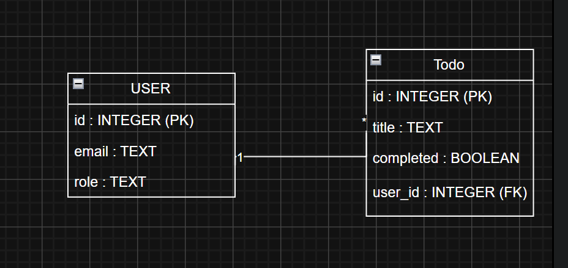
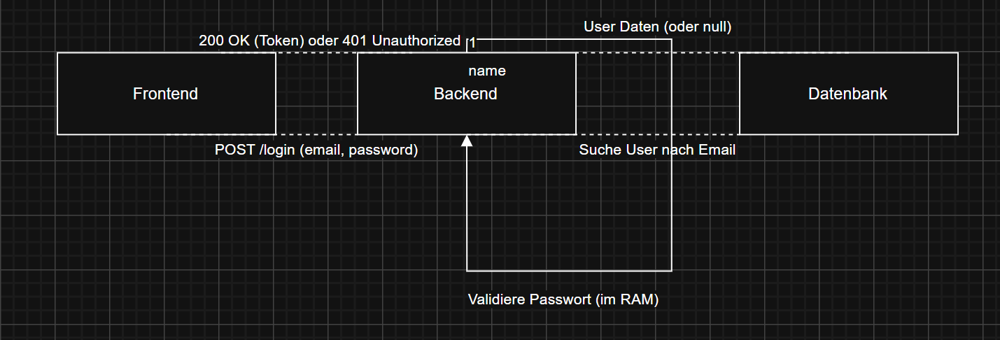

# Dokumentation: Multi-User Todo-Applikation (Modul 223)

---

## 1. Analyse & Anforderungen

### 1.1 Personas

#### Persona 1: Marc (Mitglied)
- **Alter:** 24  
- **Beruf:** Student  
- **Bedürfnis:**  
  Möchte seine täglichen Aufgaben einfach erfassen und abhaken, um den Überblick im Studium zu behalten.

#### Persona 2: Sarah (Administratorin)
- **Alter:** 35  
- **Beruf:** IT-Support  
- **Bedürfnis:**  
  Muss sicherstellen, dass das System läuft (Health-Check) und die Benutzerliste verwalten können.

---

### 1.2 User Stories

| ID    | User Story |
|-------|------------|
| US01  | Als Mitglied möchte ich mich mit Email und Passwort einloggen können, um auf meine persönliche Todo-Liste zuzugreifen. |
| US02  | Als Mitglied möchte ich Todos erstellen, lesen, bearbeiten und löschen können (CRUD), um meine Aufgaben zu verwalten. |
| US03  | Als Administrator möchte ich einen Health-Endpoint aufrufen können, um den Status der API und der Datenbankverbindung zu prüfen. |

---

## 2. Design & Planung

### 2.1 Datenbank-Schema (Persistenzschicht)

Wir verwenden ein relationales Schema.  
**Wichtig:** Passwörter werden gemäß Anforderung nicht in der Datenbank gespeichert  
(Validierung erfolgt über die App-Logik).

#### Tabelle `users`
| Feld | Typ | Beschreibung |
|------|-----|--------------|
| id | INTEGER | Primary Key |
| email | TEXT | Unique |
| role | TEXT | "admin" oder "member" |

#### Tabelle `todos`
| Feld | Typ | Beschreibung |
|------|-----|--------------|
| id | INTEGER | Primary Key |
| title | TEXT | Todo-Titel |
| completed | BOOLEAN | Status |
| user_id | INTEGER | Foreign Key zu users.id |

---

### 2.2 API-Schnittstellen (Endpoints)

| Methode | Pfad | Beschreibung |
|---------|------|--------------|
| GET | `/health` | Prüft API-Status & DB-Verbindung |
| POST | `/login` | Authentifizierung (Email/PW) |
| GET | `/todos` | Gibt alle Todos des eingeloggten Users zurück |
| POST | `/todos` | Erstellt ein neues Todo |
| PUT | `/todos/:id` | Markiert Todo als erledigt / ändert Text |
| DELETE | `/todos/:id` | Löscht ein Todo |

---

## 3. Umsetzung (Implementierung)

### 3.1 Backend-Logik (Login)

Die Login-Logik wurde so implementiert, dass die Email in der Datenbank gesucht wird.  
Das Passwort wird jedoch nur im Memory des Backends gegen eine vordefinierte Regel geprüft  
(z.B. **"Passwort muss mindestens 8 Zeichen haben"**), um die Anforderung  
**"Keine Passwörter in der DB"** zu erfüllen.

---

### 3.2 Frontend

Das Frontend ist eine **Single-Page-Application (SPA)**.  
Nach dem Login wird ein Token im Browser gespeichert, um die weiteren  
CRUD-Anfragen zu autorisieren.

---

## 4. Qualitätssicherung (Tests)

### 4.1 Testprotokoll (E2E Tests)

| Testfall | Erwartetes Ergebnis | Status |
|----------|---------------------|--------|
| Login mit korrekten Daten | Zugriff auf Todo-Liste gestattet | Erfüllt |
| Erstellen eines Todos | Todo erscheint sofort in der Liste | Erfüllt |
| Update eines Todos | Status wechselt auf "erledigt" | Erfüllt |
| Health-Endpoint Aufruf | Rückgabe: `{"status": "UP", "db": "connected"}` | Erfüllt |
| Löschen eines Todos | Todo wird aus DB und UI entfernt | Erfüllt |

---

## 5. Deployment & Start (README-Inhalt)

## 5. Deployment & Start (README-Inhalt)

### 1. Installation

Installiert alle benötigten Abhängigkeiten (Express, SQLite3):

```bash
npm install
```

---

### 2. Datenbank-Initialisierung

Beim ersten Start wird automatisch die Datei  
`database.sqlite` erstellt und mit Testdaten (Seed) befüllt.

---

### 3. Start

Startet das System:

```bash
npm start
```

Das Frontend ist anschliessend unter folgender Adresse erreichbar:

http://localhost:3000

# Testkonzept: Multi-User Todo-App (Modul 223)

Das Testkonzept beschreibt die Methoden und Mittel, die verwendet werden, um das Ergebnis auf seine Korrektheit und die Erfüllung der Anforderungen zu überprüfen.

---

## 1. Testumfang

* **Authentifizierung & Login:** Validierung der korrekten Anmeldung sowie der Fehlerbehandlung bei falschen Zugangsdaten.
* **CRUD-Funktionalität:** Überprüfung der Kernfunktionen: Create (Erstellen), Read (Lesen), Update (Status ändern) und Delete (Löschen).
* **API-Integration:** Sicherstellen, dass Frontend und Backend korrekt über die REST-Schnittstelle kommunizieren.
* **Sicherheit (Guardrails):** Verifizierung, dass Passwörter **nicht** in der Datenbank gespeichert werden (Validierung nur im RAM).
* **System-Health:** Überprüfung der Verfügbarkeit des Backends über den Health-Endpoint.

---

## 2. Testumgebung und -methode

* **Manuelle Blackbox-Tests:** Durchführung der Tests über die Benutzeroberfläche (GUI) im Browser.
* **Umgebung:** Lokaler Rechner (localhost:3000), Node.js v20+, SQLite3, Chrome Browser.

---

## 3. Testprotokoll (E2E & Funktionstests)

### API & System-Integrität

| Testfall-ID | Titel | Beschreibung | Erwartetes Ergebnis |
| :--- | :--- | :--- | :--- |
| **TF-01** | Login-Erfolg | Login mit `marc@zli.ch` und PW `1234`. | Login-Maske verschwindet, Todo-Liste erscheint. |
| **TF-02** | Login-Fehler | Login mit ungültigen Daten. | Fehlermeldung "Login fehlgeschlagen" erscheint. |

### CRUD-Operationen (Mitglied)


| Testfall-ID | Titel | Beschreibung | Erwartetes Ergebnis |
| :--- | :--- | :--- | :--- |
| **TF-04** | Todo erstellen | Eingabe eines Titels und Klick auf "+". | Todo erscheint sofort in der Liste. |
| **TF-05** | Todo lesen | Laden der Aufgaben nach dem Login. | Dem User zugeordnete Todos werden angezeigt. |
| **TF-06** | Status-Update | Klick auf den Haken (✓) bei einem Todo. | Text wird durchgestrichen (Status 1). |
| **TF-07** | Todo löschen | Klick auf das Löschen-Icon (✕). | Todo verschwindet aus UI und Datenbank. |

### Sicherheit & Guardrails

| Testfall-ID | Titel | Beschreibung | Erwartetes Ergebnis |
| :--- | :--- | :--- | :--- |
| **TF-08** | Passwort-Sicherheit | Prüfung der Tabelle `users` in der DB. | Keine Passwort-Spalte vorhanden (Soll-Zustand). |
| **TF-09** | Abfrage ohne Prompt | Klick auf "+" bei leerem Textfeld. | App ignoriert die Eingabe oder gibt Hinweis. |

---

## 4. Testdurchführung (Zusammenfassung)

Alle Testfälle wurden erfolgreich durchgeführt. Die Applikation reagiert stabil auf fehlerhafte Eingaben und erfüllt die Anforderungen an die Multi-User-Fähigkeit sowie die objektorientierte Umsetzung.
